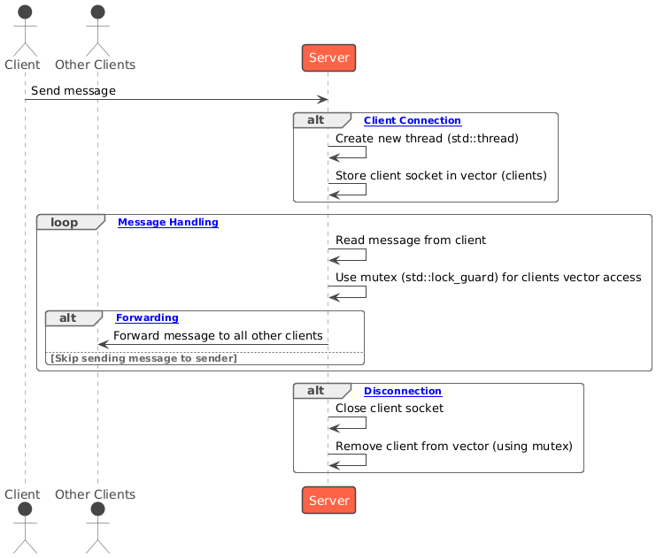

# Chatroom Project (C++ Socket Programming)

## Introduction
This project implements a basic **chatroom** application using **C++ socket programming**. The chatroom consists of a **server** and multiple **client instances** interacting with each other in real time. The server handles message broadcasting, while the clients can send and receive messages. Essential operating system concepts such as **multithreading** and **mutex locks** are used to manage concurrent connections and ensure safe access to shared resources.

## Features
- **Multiple Clients**: Supports simultaneous connections.
- **Real-time Communication**: Messages are forwarded instantly between clients.
- **Threaded Server**: Manages clients on separate threads.
- **Mutex Protection**: Uses `std::mutex` to prevent data races.
- **Graceful Disconnections**: Handles exits and resource cleanup efficiently.

## Implementation
### Key Components:
1. **Server**: Manages multiple clients and broadcasts messages.
2. **Clients**: Users connect to the server and exchange messages with other clients.

### Functions in Server Code:
- **Initialize()**: Initializes Winsock.
- **InteractWithClient()**: Handles interactions with individual clients on a new thread.
- **main()**: Manages the socket lifecycle, listens for clients, and creates threads for each connection.

### Functions in Client Code:
- **Initialize()**: Initializes Winsock.
- **SendMsg()**: Sends messages from the client to the server.
- **ReceiveMsg()**: Receives messages from the server and displays them.
- **main()**: Establishes a connection to the server and starts the chat threads.

## OS and Networking Concepts Used
1. **Multithreading**:  
   - Each client connection is handled by a separate thread, ensuring concurrent communication.  
   - Server uses `std::thread` to create new threads for connected clients.

2. **Mutex Locks**:  
   - A mutex lock ensures that the clients vector is safely modified by multiple threads without data races.

3. **Socket Programming**:  
   - Uses **Winsock** for socket creation, binding, and communication between server and clients.
   - Sockets are provided by the OS as an interface to the networking stack.

## UML Diagrams

### 1. Server Workflow Diagram


### 2. Client-Server Interaction Diagram

   

## How to Run
### Prerequisites:
- **Windows OS** with Visual Studio (or any compatible C++ compiler).
- Winsock library installed (default with Visual Studio).

### Steps to Run:

1. **Clone the repository**:
   ```bash
   git clone https://github.com/sriimalya/winsock-chatroom.git
   cd winsock-chatroom
2. **Compile the server**: Navigate to the bin/ directory and compile the server.cpp file:
   ```bash
   g++ -o bin/Server.exe Server/server.cpp -lws2_32

3. **Compile the Client**: Similarly, compile the client.cpp file:
   ```bash
   g++ -o bin/Client.exe Client/client.cpp -lws2_32
   
   Note: To connect multiple clients, open a new Command Prompt window for each client you want to connect to the server.
   
4. **Run the server**: Open a new Command Prompt window and navigate to the bin directory of the project and run the Server:
   ```bash
   cd bin
   Server.exe
   
5. **Run the Client**: Open another terminal or command prompt, and again navigate to the bin directory:
   ```bash
   cd bin
   Client.exe
   
6. **Test the chatroom**:
   - In each client terminal, you will be prompted to enter a chat name.
   - Start exchanging messages between clients connected to the same server.
   

## Limitations

1. **Limited Scalability**: The server can handle multiple clients, but cannot efficiently manage a large number of connections due to:
   - **Thread overhead**: Each connection spawns a new thread, which may exhaust system resources.
   - **Blocking accept() call**: Only one client connection can be accepted at a time.

2. **Windows-Specific Implementation**:
   - Uses Winsock, which makes it incompatible with non-Windows systems without significant modifications.

## Extensions Possible
1. **Non-blocking I/O**: Implement asynchronous sockets to avoid blocking operations.
2. **Optimized Thread Pool**: Use a thread pool instead of creating a new thread for each client.
3. **Cross-Platform Support**: Replace Winsock with cross-platform libraries like Boost.Asio.
4. **Encryption**: Add TLS encryption for secure communication.
5. **WebSocket Support**: Make the chatroom accessible from web browsers using WebSocket protocols.


## Project Screenshots

### Server connected with three clients


